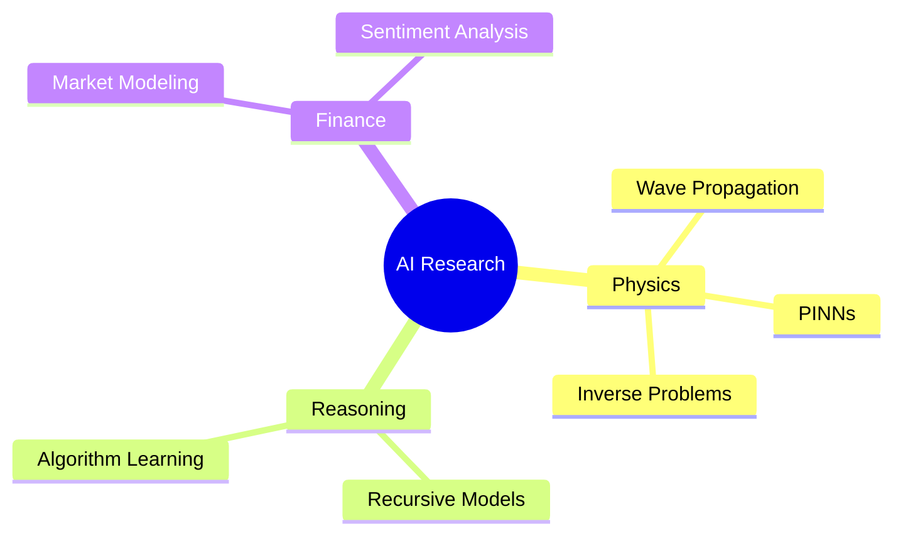

<div align="center">


[](https://git.io/typing-svg)

<a href="mailto:Bao.X.Tran.Work@gmail.com"></a>
<a href="https://linkedin.com/in/baotran211/"></a>
<a href="https://scholar.google.com/"></a>


*"Bridging the deterministic beauty of Physics with the predictive power of Machine Learning"*
</div>

---

### 🎓 Currently
- 🏛️ **BSc Artificial Intelligence** @ VNU-UET (GPA: 3.66/4.0, Expected 2026)
- 🔬 **Undergraduate Research Assistant** @ NDE Lab (NAFOSTED funded) — Focus: **PINNs** for ultrasonic wave propagation.
- 🧠 **AI Researcher** @ Recursive Reasoning Institute — Focus: Neural algorithm learning.

---

### 🔬 Research Interests
<p align="left">


</p>

---

### 🛠️ Tech Stack
| Category | Tools |
| :--- | :--- |
| **AI & Computing** |     |
| **MLOps & Dev** |     |

---

### 🚀 Featured Projects
*   **AInvest** | `FastAPI` `FinBERT` `DeepSeek` `RAG`  
    *Automated Equity Research platform integrating LLMs with financial sentiment analysis.*
*   **Hearo** | `Voice AI` `Faster-Whisper` `spaCy`  
    *🥉 3rd Place CAMPATHON 2025. Smart meeting assistant for automated summarization.*
*   **Bone PINNs** | `Physics-Informed ML` `Biot's Theory`  
    *Solving inverse problems in ultrasonic material characterization.*

---

### 📚 Publications & Awards
- 📝 **Publication:** *Ultrasonic material characterization using physics-informed deep learning* - **COMOSA 2025**
- 🏆 **3rd Place**, CAMPATHON 2025: The Flow of Technology
- 🎓 **VNU-UET Excellence Scholarship** (2024-2025)

---

### 📊 GitHub Analysis
<div align="center">
  <table border="0">
    <tr>
      <td></td>
      <td></td>
    </tr>
  </table>
  
</div>

---

### 🎯 Research Roadmap

<div align="center">
  <br />
    📧 <b>Bao.X.Tran.Work@gmail.com</b> | 🔗 <b>linkedin.com/in/baotran211/</b>
  <br />
  
</div>
```
